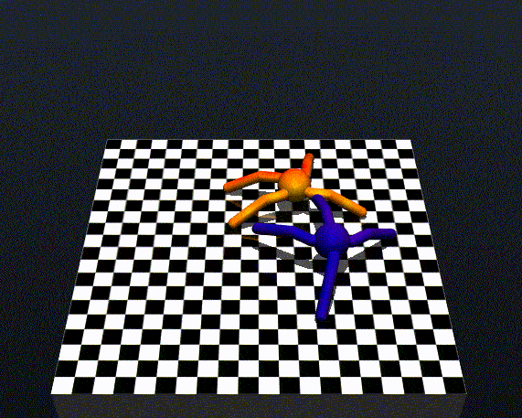

# MuJoCo Battle Arena (The MuJoCo Men)

A reinforcement learning project where agents learn to fight each other in a physics-based arena using JAX and MuJoCo.



## Overview

This project implements a training pipeline for AI agents that fight each other in a physics-based arena. 
The agents are trained using the Soft Actor-Critic (SAC) algorithm with JAX acceleration. The environment is built using MuJoCo physics engine, featuring two four-legged agents attempting to push each other off a 2.5x2.5x1.5 platform.

## Requirements

- JAX with CUDA support
- MuJoCo and MuJoCo MJX
- Weights & Biases or Tensorboard (optional, for experiment tracking)
- See `requirements.txt` for full dependencies

## Installation

```bash
# Clone the repository
git clone https://github.com/r-aristov/arena.git
cd arena

# Install other dependencies
pip install -r requirements.txt
```

## Usage

To start training:
```bash
python sac_my_flax.py
```

To watch trained agents fight:
```bash
# starts with pretrained agents if no parameters specified
python arena.py
# Or specify custom agents:
python arena.py --agent0="path/to/your/agent0" --agent1="path/to/your/agent1"
```

## Configuration

Key training parameters can be adjusted in `sac_my_flax.py`:
- Batch sizes
- Buffer size
- Learning rates
- Training steps
- Self-play parameters
- SAC metaparameters

## Project Structure

- `sac_my_flax.py` - Startup script with pipeline configuration
- `arena.py` - Environment implementation and visualization
- `worker.py` - Worker thread, responsible for simulation, observation gathering and agent validation
- `buffer.py` - Replay buffer implementation
- `trainer.py` - Trainer thread, takes replays from buffer and trains q-network and policy network
- `agent.py` - Simple policy network implemented in Flax
- `q_network.py` - Simple q-network implemented in Flax
- `running_mean_std_jax.py` - Running mean jax implementation for observation normalization
- `models/` - MuJoCo model definitions
- `legacy-agents/` - Pretrained agents to use as reference and validation
- `obs-norm/` - Precomputed mean and var values for observation normalization
